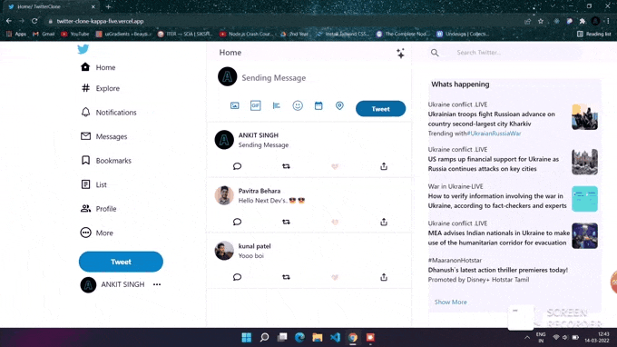

<p align="center">
  <a href="https://nextjs.org">
    
    
  </a>
</p>


# Project Name : Twitter-Clone

This is a clone of Twitter . This build is for learning purpose only.

# Technology Used To Build This
<p >
  <a href="https://nextjs.org/">
    
  </a>
  <a href="https://reactjs.org/">
    
  </a>
  <a aria-label="NPM version" href="https://firebase.google.com/">
     
  </a>
  <a aria-label="Vercel logo" href="https://www.javascript.com/">
    
  </a>
  <a aria-label="NPM version" href="https://www.npmjs.com/">
    
  </a>
  <a aria-label="NPM version" href="https://tailwindcss.com/">
    
  </a>
  <a></a>
<a></a>
  </p>

# How it look's




# Some important information about Next.Js
## Getting Started

First, run the development server:

```bash
npm run dev
# or
yarn dev
```

Open [http://localhost:3000](http://localhost:3000) with your browser to see the result.

You can start editing the page by modifying `pages/index.js`. The page auto-updates as you edit the file.

[API routes](https://nextjs.org/docs/api-routes/introduction) can be accessed on [http://localhost:3000/api/hello](http://localhost:3000/api/hello). This endpoint can be edited in `pages/api/hello.js`.

The `pages/api` directory is mapped to `/api/*`. Files in this directory are treated as [API routes](https://nextjs.org/docs/api-routes/introduction) instead of React pages.

## Learn More

To learn more about Next.js, take a look at the following resources:

- [Next.js Documentation](https://nextjs.org/docs) - learn about Next.js features and API.
- [Learn Next.js](https://nextjs.org/learn) - an interactive Next.js tutorial.

You can check out [the Next.js GitHub repository](https://github.com/vercel/next.js/) - your feedback and contributions are welcome!

## Deploy
Link: https://twitter-clone-kappa-five.vercel.app/

# Thank You For Visiting
